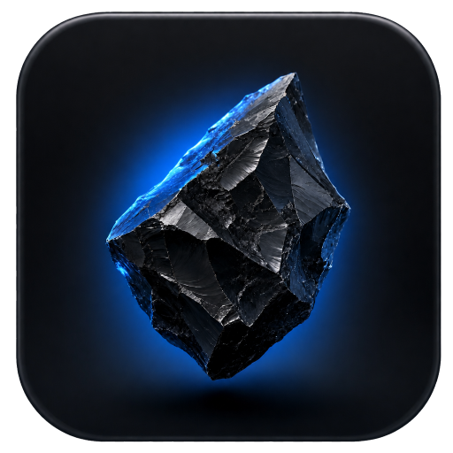

<div align="center">



# Anthracite

A macOS-shaped [Hyprland](https://hypr.land) desktop for a ThinkPad X1 Carbon — compositor, shell, lock screen and login, on Apple's dark system palette.

> _Hard, dense, and very black._


</div>

---

## What this is

A complete desktop, not a theme. The compositor config, an [AGS v3](https://aylur.github.io/ags/) shell that draws the menu bar, dock, Spotlight and Control Center, and the system files that make a session start at all.

Split out of [dotfiles](https://github.com/kevinlangleyjr/dotfiles), which clones this repo on Linux desktops and leaves it alone everywhere else. Shell components are documented separately in [`.config/ags/README.md`](.config/ags/README.md).

---

## Layout

```
┌──────────────────────────────────────────────────────────────────────────────┐
│   Ghostty                    3%  20%  37°  ▮▮▮  󰖩  46%  Sat Sep 5  6:59 PM │
├──────────────────────────────────────────────────────────────────────────────┤
│                                                                              │
│                        ╭──────────────────────────╮                          │
│                        │  Spotlight Search        │                          │
│                        ╰──────────────────────────╯                          │
│                                                                              │
│                      ╭────────────────────────────────╮                      │
│                      │   ▢   ▢   ◉   ▢   ▢   ▢        │                      │
│                      ╰────────────────────────────────╯                      │
└──────────────────────────────────────────────────────────────────────────────┘
```

- **Menu bar** —  menu, focused application's name in semibold, then status items and the clock
- **Dock** — pinned and running apps, magnifying under the pointer with the falloff spreading to neighbours
- **Between** — everything floats; see [Why everything floats](#why-everything-floats)

---

## Palette

Apple's published dark-appearance system colours, not approximations — so the shell, the WhiteSur GTK theme and Ghostty's "Apple System Colors" all agree without a fourth set of hand-picked values.

### Surfaces

|                                                          | Hex       | Used by                                  |
| -------------------------------------------------------- | --------- | ---------------------------------------- |
|  | `#1c1c1e` | deepest surface                          |
|  | `#1e1e1e` | panel ground — Spotlight, dock, OSD      |
|  | `#2c2c2e` | raised surfaces — Control Center, cards  |

### Labels

|                                                          | Hex       | Used by                        |
| -------------------------------------------------------- | --------- | ------------------------------ |
|  | `#ffffff` | primary text                   |
|  | `#98989d` | secondary label                |
|  | `#6e6e73` | tertiary label                 |
|  | `#48484a` | separator                      |

### System colours

|                                                          | Hex       | Meaning                                     |
| -------------------------------------------------------- | --------- | ------------------------------------------- |
|  | `#0a84ff` | systemBlue — the accent: selection, toggles |
|  | `#ff453a` | systemRed — errors, critical battery        |
|  | `#30d158` | systemGreen — connected, charging           |
|  | `#ffd60a` | systemYellow — warnings                     |
|  | `#ff9f0a` | systemOrange — recording                    |
|  | `#bf5af2` | systemPurple                                |
|  | `#64d2ff` | systemCyan                                  |

### Compositor

Set in `hyprland.lua` rather than SCSS, because they carry alpha:

| Element         | Value                                                         |
| --------------- | ------------------------------------------------------------- |
| Active border   | `ffffff26` — macOS separates a focused window by its shadow, not an outline |
| Inactive border | `00000040`                                                    |
| Shadow          | `40000000`, range 30, offset `0 8`                            |
| Rounding        | `10px` — Big Sur window radius                                |

Everything else lives in [`.config/ags/style/_palette.scss`](.config/ags/style/_palette.scss); recolouring the whole shell is that one file.

---

## Components

| Component        | What it is                                                       | Source                        |
| ---------------- | ---------------------------------------------------------------- | ----------------------------- |
| Menu bar         |  menu, app name, status items, clock                            | `widget/Bar.tsx`              |
| Dock             | Big Sur dock, pointer-distance magnification, running dots       | `widget/Dock.tsx`             |
| Spotlight        | centred search — `SUPER` + `R`                                   | `widget/Applauncher.tsx`      |
| Control Center   | connectivity, Focus, Mic, Display and Sound sliders, Now Playing | `widget/QuickSettings.tsx`    |
|  menu           | Sleep / Restart / Shut Down / Lock / Log Out, with confirmation  | `widget/PowerMenu.tsx`        |
| Switcher         | Cmd+Tab-style icon row, ordered by recency                       | `widget/WindowSwitcher.tsx`   |
| Notifications    | rounded cards, top right                                         | `widget/Notifications.tsx`    |
| OSD              | volume panel with a segmented level                              | `widget/OSD.tsx`              |
| System stats     | CPU, RAM, disk, top processes                                    | `widget/SystemStats.tsx`      |
| Tailscale        | connection indicator and toggle                                  | `widget/Tailscale.tsx`        |
| Lock screen      | hyprlock, same palette                                           | `.config/hypr/hyprlock.conf`  |
| Idle ladder      | dim → lock → screen off → suspend                                | `.config/hypr/hypridle.conf`  |

---

## Requirements

- **Arch** or a derivative, and an **AUR helper** (`paru` or `yay`) — `aylurs-gtk-shell-git`, `libastal-meta`, the WhiteSur themes and the Apple fonts have no repo packages
- **Hyprland** ≥ 0.56 — `hyprland.lua` uses the Lua config API
- The [dotfiles](https://github.com/kevinlangleyjr/dotfiles) repo is *not* required; this installs standalone

---

## Installation

```sh
git clone git@github.com:kevinlangleyjr/anthracite-desktop.git ~/.anthracite-desktop
~/.anthracite-desktop/install.sh
```

Then set your monitors in `.config/hypr/local.lua` and reboot into the session.

### What the installer does

1. Installs `packages.txt` with `pacman --needed`, then `packages-aur.txt` with `paru` or `yay`
2. Symlinks each `.config/<name>` to `~/.config/<name>`, moving anything already there aside as `<name>.old`
3. Seeds `.config/hypr/local.lua` from the example — gitignored, so monitor config survives pulls and branch switches
4. Sets the dconf appearance keys. GTK3 reads `settings.ini`, GTK4 and libadwaita read dconf, and a mismatch leaves the desktop half themed
5. Points `xdg-terminals.list` at Ghostty
6. Reports drift against the tracked `etc/` copies — it does **not** write to `/etc` without `--system`

---

## System files

Three files outside `$HOME` are part of this setup. Two are modified package files; one is owned by no package at all.

| Tracked copy             | Why it matters                                                                                            |
| ------------------------ | --------------------------------------------------------------------------------------------------------- |
| `etc/greetd/config.toml` | The `tuigreet --cmd start-hyprland` line. This is how the session launches at all.                          |
| `etc/pam.d/greetd`       | The two `pam_gnome_keyring` lines. Without them the keyring never unlocks and the Secret Service is dead.   |
| `etc/pam.d/polkit-1`     | Owned by **no package**. Puts `pam_fprintd.so` ahead of the stack for fingerprint auth on privilege prompts. |

```sh
./install.sh --system     # sudo; backs up each file as <name>.bak-<timestamp>
```

Overwriting `/etc/pam.d/*` on a routine re-run is how you lock yourself out of a machine, hence the flag.

Everything else outside `$HOME` is stock: `/etc/pam.d/hyprlock`, the `wayland-sessions` desktop files, `/etc/environment`, `/etc/security/*`. `/etc/udev/rules.d/` is empty and needs nothing — this `brightnessctl` writes brightness through logind's D-Bus `SetBrightness`, not sysfs.

### Units to enable

Installing the packages does not enable these:

```sh
sudo systemctl enable greetd NetworkManager NetworkManager-dispatcher \
    NetworkManager-wait-online power-profiles-daemon bluetooth
sudo systemctl enable --now reflector.timer paccache.timer
```

`greetd` is the one that matters — without it you boot to a TTY.

### Groups

The login user needs `wheel` and nothing else. Device access comes from logind's per-session ACLs, so `video` / `input` / `seat` membership is neither needed nor helpful.

---

## Keyboard

**The keyboard is deliberately not macOS-like.** Shortcuts are Linux-native:
`Ctrl` is the application modifier, and `SUPER` belongs to the compositor.

The obvious thing to try is a `keyd` layer making the key beside the spacebar
act as Control, so `Cmd`+`C`, `Cmd`+`S` and `Cmd`+`Q` work everywhere without
per-app configuration. It was built, and then rejected, for a reason worth
recording so it does not get rebuilt:

**`keyd` is app-agnostic.** It cannot tell a terminal from a browser, so
mapping Cmd onto Control maps it there too — and `Ctrl`+`C` in a terminal is
SIGINT. macOS keeps these separate: Terminal.app has `Cmd`+`C` for copy *and*
`Ctrl`+`C` for interrupt, at the same time, because they are genuinely
different keys. Collapsing both onto Control means the most reflexive shortcut
on the platform kills the running process instead of copying. There is no fix
at that layer; the compositor knows which window is focused, and the input
remapper does not.

Against that, the upside — Cmd chords feeling right in GUI apps — did not
justify a root-level input layer whose failure mode is recovering from a TTY.

Everything else here imitates macOS. The keyboard is where the imitation stops.

## Keybindings

`SUPER` is the mod.

| Key                                | Action                                                     |
| ---------------------------------- | ---------------------------------------------------------- |
| `SUPER` + `C` / `E` / `R`          | Ghostty / Files / Spotlight                                |
| `SUPER` + `Q`                      | Close window                                               |
| `SUPER` + `F`                      | Snap to work area; again to restore                        |
| `SUPER` + `V`                      | Toggle floating                                            |
| `ALT` + `Tab`                      | Switcher, ordered by recency (`SHIFT` reverses)            |
| `SUPER` + `A` / `M` / `L`          | Control Center /  menu / lock                             |
| `SUPER` + arrows                   | Move focus (`SHIFT` moves, `CTRL` resizes)                 |
| `SUPER` + `1`–`0`                  | Switch workspace (`SHIFT` moves the window)                |
| `SUPER` + `S` / `SHIFT` + `S`      | Scratchpad / move window to it                             |
| `CTRL` + `ALT` + `Space`           | Emoji picker                                               |
| `Print`                            | Screenshot (`SHIFT` region, `ALT` window, `CTRL` annotate) |
| `SUPER` + `SHIFT` + `V` / `C`      | Clipboard history / colour picker                          |
| `SUPER` + `SHIFT` + `R`            | Record screen (`CTRL` + `SHIFT` + `R` for a region)        |

Screenshots land in `~/Pictures/Screenshots` and are copied to the clipboard.

### Why everything floats

A `float-by-default` rule floats every window. Hyprland renders tiled windows in a pass *below* floating ones, so a tiled window can never be raised above a floating neighbour — the switcher would move focus to it correctly and still leave it buried. One z-order stack makes raise-on-focus work everywhere. `SUPER` + `V` still tiles an individual window.

---

## Per-machine values

`.config/hypr/local.lua` is gitignored and seeded from `local.lua.example`. Monitors, scale and host-specific env go there — never in `hyprland.lua`:

```lua
hl.monitor({ output = "eDP-1", mode = "1920x1200@60", position = "0x0", scale = 1 })
```

`hyprland.lua` loads it with `pcall(require, "local")`, so a missing file is harmless.

---

## Health check

```sh
./doctor.sh
```

Checks the symlinks, `local.lua`, every binary the configs invoke by name, drift against the `etc/` copies, and the services package installation does not enable. `dotfiles-doctor` calls this automatically when the repo is present.

---

## Customize

- **All shell colours**: `.config/ags/style/_palette.scss` — one file, everything downstream
- **Borders, gaps, rounding, blur**: the `general` and `decoration` blocks in `hyprland.lua`
- **Dock pins**: `PINNED` in `widget/Dock.tsx`, by desktop entry id
- **Dock magnification**: `MAGNIFY` and the falloff radius in `widget/Dock.tsx`
- **Workspace count**: `WORKSPACE_COUNT` in `widget/Bar.tsx`
- **Idle timings**: `.config/hypr/hypridle.conf`

After editing Lua, `hyprctl reload`. After editing the shell, `ags quit && ags run`.

### AGS versions

The `ags` and `gnim` entries in `package.json` are `"*"` on purpose, and there is deliberately no lockfile. AGS's bundler aliases both names to `/usr/share/ags/js`, so the code that runs always comes from the installed `aylurs-gtk-shell-git` build regardless of what npm resolves — and the npm package named `ags` is an unrelated, defunct one that `npm install` would choke on. The version that matters is the AUR build; last tested against `3.1.2.r0.gbbee2f1-2`. Run `ags types -u` after upgrading.

---

## Troubleshooting

**Booted to a TTY.** `systemctl status greetd` — usually greetd isn't enabled, or `/etc/greetd/config.toml` lost its `start-hyprland` command.

**No fingerprint prompt on privilege dialogs.** Diff `/etc/pam.d/polkit-1` against `etc/pam.d/polkit-1`; PAM parse errors show up in `journalctl -b | grep polkit`.

**Bar or dock missing.** `ags list` shows registered windows; run `ags run` in a terminal to see the errors the autostart swallows.

**A keybind does nothing.** This Hyprland parses dispatch payloads as **Lua**, so `hyprctl dispatch exit` resolves the bare word to nil and silently fails. Use `hyprctl dispatch hl.dsp.exit()`. The same applies to `hyprctl keyword`, which does not work against the Lua parser at all — use `hyprctl eval` instead.

**No fingerprint prompt on the lock screen.** hyprlock renders
`$FPRINTPROMPT` only once it has claimed a reader, so a reader it cannot claim
produces a bare "Enter password" rather than an error — indistinguishable from
fingerprint never having been set up. Check `journalctl -b -u fprintd`. `Device
was already claimed` means a stale claim: a verification that was in flight
when the reader dropped off the bus never released it, and `sudo systemctl
restart fprintd` clears it. The udev rule in `etc/` stops the reader
disappearing in the first place.

**Screen never locks.** `pgrep hypridle` — started from `hyprland.lua`, fails silently if absent.

Or just run `./doctor.sh`, which checks all of the above.

---

## License

[WTFPL](LICENSE) — Do What The Fuck You Want To Public License, Version 2.
