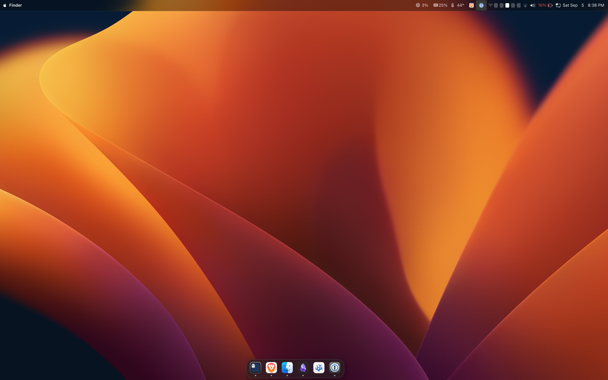

<div align="center">


<picture>
  <source media="(prefers-color-scheme: dark)" srcset="https://getslatewave.com/brand/wordmark-light.png">
  
</picture>

# Slatewave (Hyprland)

A complete [Hyprland](https://hypr.land) desktop — compositor, shell, lock screen and login — on a warm-gray foundation with a teal signature. Part of the [Slatewave family](#slatewave-family) — one palette across editors, terminals, prompts, notes, and more.

> _Slate below, teal above._



</div>

---

## Layout

A top bar, a bottom dock, and floating windows between them:

```
┌──────────────────────────────────────────────────────────────────────────────┐
│  ⬢   1 2 3 4 5        kitty — ~/.dotfiles        12%  4/16GB   󰖩  83%  3:04 PM │
├──────────────────────────────────────────────────────────────────────────────┤
│                                                                              │
│                            ╭────────────────────╮                            │
│                            │   Alt-Tab switcher │                            │
│                            ╰────────────────────╯                            │
│                                                                              │
│                    ▁▁▁▁▁▁▁▁▁▁▁▁▁▁▁▁▁▁▁▁▁▁▁▁▁▁▁▁▁▁                            │
│                      ▢    ▢    ▢    ▢    ▢    ▢                              │
└──────────────────────────────────────────────────────────────────────────────┘
```

- **Bar**: launcher glyph → workspaces → focused window → system stats → Tailscale → volume → battery → clock
- **Dock**: pinned and running apps, no exclusive zone, so windows can sit over it
- **Between**: everything floats by default — see [Why everything floats](#why-everything-floats)

---

## Palette

### Foundation — chrome grays

The same warm-neutral scale as the Slatewave prompt and editor themes, so the desktop, terminal and editor read as one surface.

|                                                          | Hex       | Used by                                     |
| -------------------------------------------------------- | --------- | ------------------------------------------- |
|  | `#1a1e26` | window shadow, deepest surface              |
|  | `#2c313a` | bar and popover ground                      |
|  | `#3e4451` | widget surfaces, quick-settings tiles       |
|  | `#e2e8f0` | primary text                                |
|  | `#94a3b8` | secondary text, CPU / RAM readout           |
|  | `#64748b` | subtle text, inactive glyphs                |
|  | `#475569` | borders, **inactive window border**         |

### Signature — teal

|                                                          | Hex       | Used by                                             |
| -------------------------------------------------------- | --------- | --------------------------------------------------- |
|  | `#5eead4` | accent, focused workspace, **active border** start |
|  | `#2dd4bf` | active-state gradient end                           |
|  | `#193549` | foreground on accent fills                          |

### Named colors

|                                                          | Hex       | Meaning                          |
| -------------------------------------------------------- | --------- | -------------------------------- |
|  | `#fb7185` | rose — errors, power-off action  |
|  | `#34d399` | emerald — connected, charging    |
|  | `#fbbf24` | amber — warnings, low battery    |
|  | `#38bdf8` | sky — **active border** end      |
|  | `#b388ff` | violet — notifications           |
|  | `#fb923c` | orange — recording indicator     |

### Compositor

Set in `hyprland.lua` rather than SCSS, so they carry alpha:

| Element           | Value                                                        |
| ----------------- | ------------------------------------------------------------ |
| Active border     | `5eead4ee` → `38bdf8ee`, 45° gradient                        |
| Inactive border   | `475569aa`                                                   |
| Shadow            | `1a1a1a` at `ee`, range 4                                    |
| Rounding          | `12px` — matches the shell's `$radii` token                  |

All shell colors live in [`.config/ags/style/_palette.scss`](.config/ags/style/_palette.scss).

---

## Components in detail

| Component      | Shows                                                              | Source                             |
| -------------- | ------------------------------------------------------------------ | ---------------------------------- |
| Bar            | workspaces, focused window, stats, tray, clock                     | `widget/Bar.tsx`                   |
| Dock           | pinned + running apps                                              | `widget/Dock.tsx`                  |
| App launcher   | fuzzy app search — `SUPER` + `R`                                   | `widget/Applauncher.tsx`           |
| Quick settings | volume, brightness, network, bluetooth, power profile              | `widget/QuickSettings.tsx`         |
| Power menu     | lock / logout / suspend / reboot / power off, with confirmation    | `widget/PowerMenu.tsx`             |
| Window switcher| Alt-Tab overlay; commits on Alt release                            | `widget/WindowSwitcher.tsx`        |
| Notifications  | popup toasts                                                       | `widget/Notifications.tsx`         |
| OSD            | volume / brightness overlay driven by the media keys               | `widget/OSD.tsx`                   |
| System stats   | CPU, RAM, disk, top processes                                      | `widget/SystemStats.tsx`           |
| Tailscale      | connection indicator and toggle                                    | `widget/Tailscale.tsx`             |
| Lock screen    | hyprlock, same palette                                             | `.config/hypr/hyprlock.conf`       |
| Idle ladder    | dim → lock → screen off → suspend                                  | `.config/hypr/hypridle.conf`       |

---

## Requirements

- **Arch** or an Arch derivative, and an **AUR helper** (`paru` or `yay`) — `aylurs-gtk-shell-git` has no repo package, and without it there is no shell
- **Hyprland** ≥ 0.56 — `hyprland.lua` uses the Lua config API
- A **Nerd Font** for the bar and dock glyphs — `ttf-jetbrains-mono-nerd`

The [dotfiles](https://github.com/kevinlangleyjr/dotfiles) repo is *not* required. This installs standalone; dotfiles simply knows how to clone it.

---

## Installation

```sh
git clone https://github.com/kevinlangleyjr/slatewave-desktop.git \
  ~/.slatewave-desktop

~/.slatewave-desktop/install.sh
```

Then set your monitors in `.config/hypr/local.lua` and reboot into the session.

### What the installer does

1. Installs `packages.txt` with `pacman --needed`, then `packages-aur.txt` with `paru` or `yay`
2. Symlinks each `.config/<name>` to `~/.config/<name>`, moving anything already there aside as `<name>.old`
3. Seeds `.config/hypr/local.lua` from the example if absent — that file is gitignored, so monitor config survives pulls and branch switches
4. Sets the dconf dark-mode keys. GTK reads the linked `settings.ini` files; Qt reads the same preference through `xdg-desktop-portal`, which is why `hyprland.lua` sets `QT_QPA_PLATFORMTHEME=xdgdesktopportal`
5. Reports drift between `etc/` and the live system files — it does **not** write to `/etc` without `--system`

---

## System files

Three files outside `$HOME` are part of this setup. Two are package files that have been modified; one is owned by no package at all, so a fresh install silently loses it.

| Tracked copy            | Installed to               | Why it matters                                                                                                                                   |
| ----------------------- | -------------------------- | ------------------------------------------------------------------------------------------------------------------------------------------------ |
| `etc/greetd/config.toml`| `/etc/greetd/config.toml`  | The `tuigreet --cmd start-hyprland` line. This is how the session launches at all.                                                                |
| `etc/pam.d/greetd`      | `/etc/pam.d/greetd`        | Adds the two `pam_gnome_keyring` lines. Without them the keyring never unlocks, and anything using the Secret Service fails.                       |
| `etc/pam.d/polkit-1`    | `/etc/pam.d/polkit-1`      | Owned by no package. Puts `pam_fprintd.so` ahead of the normal stack, which is what lets polkit prompt for a fingerprint.                          |

```sh
./install.sh --system     # sudo; backs up each file as <name>.bak-<timestamp>
```

Overwriting `/etc/pam.d/*` on a routine re-run is how you lock yourself out of a machine, hence the flag.

Everything else outside `$HOME` is stock and returns with its package — `/etc/pam.d/hyprlock`, the `wayland-sessions` desktop files, `/etc/environment`, `/etc/security/*`. `/etc/udev/rules.d/` is empty and needs nothing: this `brightnessctl` build writes brightness through logind's D-Bus `SetBrightness`, not sysfs.

### Units to enable

Installing the packages does not enable these:

```sh
sudo systemctl enable greetd NetworkManager NetworkManager-dispatcher \
    NetworkManager-wait-online power-profiles-daemon bluetooth
sudo systemctl enable --now reflector.timer paccache.timer
```

`greetd` is the one that matters — without it you boot to a TTY.

### Groups

The login user needs `wheel` and nothing else. Device access comes from logind's per-session ACLs, so `video` / `input` / `seat` membership is neither needed nor helpful.

---

## Per-machine values

`.config/hypr/local.lua` is gitignored and seeded from `local.lua.example`. Monitors, scale and host-specific env go there — never in `hyprland.lua`:

```lua
hl.monitor({ output = "eDP-1", mode = "1920x1200@60", position = "0x0", scale = 1 })
hl.monitor({ output = "DP-1",  mode = "2560x1440@144", position = "1920x0", scale = 1 })
```

`hyprland.lua` loads it with `pcall(require, "local")`, so a missing file is harmless.

---

## Keybindings

`SUPER` is the mod.

| Key                              | Action                                                                       |
| -------------------------------- | ---------------------------------------------------------------------------- |
| `SUPER` + `C` / `E` / `R`        | Terminal (kitty) / files (nautilus) / app launcher                           |
| `SUPER` + `Q`                    | Close window                                                                 |
| `SUPER` + `F`                    | Snap to work area — full width, under the bar, above the dock. Again to restore. |
| `SUPER` + `V`                    | Toggle floating                                                              |
| `SUPER` + `J` / `P`              | Toggle split / pseudotile                                                    |
| `ALT` + `Tab`                    | Window switcher (`SHIFT` to reverse)                                         |
| `SUPER` + `A` / `M` / `L`        | Quick settings / power menu / lock                                           |
| `SUPER` + arrows                 | Move focus                                                                   |
| `SUPER` + `SHIFT` + arrows       | Move window                                                                  |
| `SUPER` + `CTRL` + arrows        | Resize window                                                                |
| `SUPER` + `1`–`0`                | Switch workspace (`SHIFT` moves the window there)                            |
| `SUPER` + `S` / `SHIFT` + `S`    | Toggle scratchpad / move window to it                                        |
| `SUPER` + scroll                 | Cycle workspaces                                                             |
| `SUPER` + drag LMB / RMB         | Move / resize window                                                         |
| `Print`                          | Screenshot — full screen                                                     |
| `SHIFT` / `ALT` / `CTRL` + `Print` | Region / window / region then annotate                                     |
| `SUPER` + `SHIFT` + `V` / `C`    | Clipboard history / colour picker                                            |
| `SUPER` + `SHIFT` + `R`          | Record screen (`CTRL` + `SHIFT` + `R` for a region)                          |

Screenshots land in `~/Pictures/Screenshots` and are copied to the clipboard.

### Why everything floats

A `float-by-default` window rule in `hyprland.lua` floats every window. Hyprland renders tiled windows in a pass *below* floating ones, so a tiled window can never be raised above a floating neighbour — the Alt-Tab switcher would move focus to it correctly and still leave it buried. One z-order stack makes raise-on-focus work everywhere. `SUPER` + `V` still tiles an individual window.

---

## Slatewave family

One palette. Every tool.

- **Editors** — [VSCode](https://github.com/kevinlangleyjr/vscode-slatewave) · [JetBrains](https://github.com/kevinlangleyjr/jetbrains-slatewave) · [Xcode](https://github.com/kevinlangleyjr/xcode-slatewave) · [Sublime Text](https://github.com/kevinlangleyjr/sublime-text-slatewave) · [Zed](https://github.com/kevinlangleyjr/zed-slatewave) · [Neovim](https://github.com/kevinlangleyjr/neovim-slatewave) · [NvChad](https://github.com/kevinlangleyjr/nvchad-slatewave) · [Helix](https://github.com/kevinlangleyjr/helix-slatewave)
- **Terminals** — [Alacritty](https://github.com/kevinlangleyjr/alacritty-slatewave) · [Ghostty](https://github.com/kevinlangleyjr/ghostty-slatewave) · [iTerm2](https://github.com/kevinlangleyjr/iterm2-slatewave) · [kitty](https://github.com/kevinlangleyjr/kitty-slatewave) · [Warp](https://github.com/kevinlangleyjr/warp-slatewave) · [WezTerm](https://github.com/kevinlangleyjr/wezterm-slatewave) · [Windows Terminal](https://github.com/kevinlangleyjr/windows-terminal-slatewave)
- **Prompts** — [Oh My Posh](https://github.com/kevinlangleyjr/slatewave-omp) · [Powerlevel10k](https://github.com/kevinlangleyjr/p10k-slatewave) · [Starship](https://github.com/kevinlangleyjr/starship-slatewave)
- **Multiplexer** — [tmux](https://github.com/kevinlangleyjr/tmux-slatewave)
- **CLI** — [bat](https://github.com/kevinlangleyjr/bat-slatewave) · [delta](https://github.com/kevinlangleyjr/delta-slatewave) · [LSD](https://github.com/kevinlangleyjr/lsd-slatewave) · [btop](https://github.com/kevinlangleyjr/btop-slatewave)
- **Notes** — [Obsidian](https://github.com/kevinlangleyjr/obsidian-slatewave) · [Logseq](https://github.com/kevinlangleyjr/logseq-slatewave) · [MarkEdit](https://github.com/kevinlangleyjr/markedit-slatewave) · [Anytype](https://github.com/kevinlangleyjr/anytype-slatewave)
- **Launchers** — [Alfred](https://github.com/kevinlangleyjr/alfred-slatewave) · [Raycast](https://github.com/kevinlangleyjr/raycast-slatewave)
- **Chat** — [Slack](https://github.com/kevinlangleyjr/slack-slatewave)

See [getslatewave.com](https://getslatewave.com) for the full family.

---

## Customize

- **All shell colors**: `.config/ags/style/_palette.scss` — one file, everything downstream
- **Window borders, gaps, rounding**: the `general` and `decoration` blocks in `.config/hypr/hyprland.lua`
- **Dock pinned apps**: `PINNED` in `widget/Dock.tsx`
- **Workspace count**: `WORKSPACE_COUNT` in `widget/Bar.tsx`
- **Power actions**: `ACTIONS` in `widget/PowerMenu.tsx`
- **Stats poll rates**: constants at the top of `widget/SystemStats.tsx`
- **Idle timings**: `.config/hypr/hypridle.conf`

After editing Lua, `hyprctl reload`. After editing the shell, `ags quit && ags run`.

### AGS versions

The `ags` and `gnim` entries in `.config/ags/package.json` are `"*"` on purpose, and there is deliberately no lockfile. AGS's bundler aliases both names to `/usr/share/ags/js`, so the code that runs always comes from the installed `aylurs-gtk-shell-git` build regardless of what npm resolves — and the npm package named `ags` is an unrelated, defunct one that `npm install` would choke on. The version that matters is the AUR build; last tested against `3.1.2.r0.gbbee2f1-2`. Run `ags types -u` after upgrading.

---

## Troubleshooting

**Booted to a TTY.** `systemctl status greetd` — usually greetd isn't enabled, or `/etc/greetd/config.toml` lost its `start-hyprland` command.

**No fingerprint prompt on privilege dialogs.** Diff `/etc/pam.d/polkit-1` against `etc/pam.d/polkit-1`. PAM parse errors surface in `journalctl -b | grep polkit`.

**Bar or dock missing.** `ags list` shows registered windows. Run `ags run` in a terminal to see the TS/JSX errors the autostart swallows.

**Screen never locks.** `pgrep hypridle` — it's started from `hyprland.lua` and fails silently if absent.

**Nothing prompts for privileges.** `pgrep -x polkit-kde-auth`, same cause.

Or just run `./doctor.sh`, which checks all of the above.

---

## License

[WTFPL](LICENSE) — Do What The Fuck You Want To Public License, Version 2.
